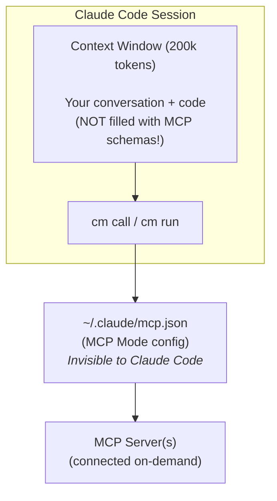

<div align="center">

<!-- IMAGE PLACEHOLDER - Replace with your image URL -->
<!--  -->

# MCP Mode

**Progressive MCP for Claude Code. Zero Token Tax.**

[](https://www.npmjs.com/package/mcp-mode)
[](https://opensource.org/licenses/MIT)
[](https://nodejs.org/)
[](#experimental-status)

Access MCP tools on-demand without loading schemas into your context window.

[Quick Start](#quick-start) · [Commands](#command-reference) · [Configuration](#configuration) · [Troubleshooting](#troubleshooting)

</div>

---

> **Note**: See [SECURITY.md](SECURITY.md) for known limitations and security considerations.

## What is MCP Mode?

MCP Mode lets you use MCP (Model Context Protocol) servers from Claude Code without the massive token cost that comes from auto-injecting tool schemas into your context window.

## The Token Tax

When you configure MCP servers in Claude Code's native config files (`~/.claude.json` or `.mcp.json`), **all tool schemas are loaded into context at session startup**. This "token tax" consumes 30-50%+ of available tokens before any conversation begins. Real-world reports show 66,000+ tokens consumed at startup (33% of 200k context).

Every MCP tool you add increases this tax. The more capable your setup, the less context you have for actual work.

## Zero-Overhead Access

MCP Mode eliminates this tax entirely by using **separate config files** (`~/.claude/mcp.json`) that Claude Code doesn't see. Servers are connected on-demand via CLI, schemas loaded only when needed, and tool calls executed outside the context window.

**Result:** Full context available for actual work. Access any number of MCP tools with zero startup cost.

---

## Installation

```bash
# Initialize in your project
npx mcp-mode init

# Or install globally
npm install -g mcp-mode
mcp-mode init
```

This creates `.claude/skills/mcp-mode/` with the skill files.

---

## Quick Start

### For Claude Desktop Users (macOS)

If you already have MCP servers configured in Claude Desktop, import them instantly:

```bash
# See what servers are available to import
.claude/skills/mcp-mode/bin/cm import --from desktop --dry-run

# Import all your servers
.claude/skills/mcp-mode/bin/cm import --from desktop

# Import specific servers only
.claude/skills/mcp-mode/bin/cm import --from desktop firecrawl Tavily
```

### For New Users

1. Create your config file at `~/.claude/mcp.json`:

```json
{
  "mcpServers": {
    "my-server": {
      "type": "stdio",
      "command": "npx",
      "args": ["-y", "my-mcp-server"],
      "env": {}
    }
  }
}
```

2. Verify it works:

```bash
.claude/skills/mcp-mode/bin/cm servers
.claude/skills/mcp-mode/bin/cm doctor --server my-server
```

---

## Using MCP Mode in Claude Code

Just tell Claude what you want to do. The skill handles the rest.

### Example Prompts

**Discovery**
> "What MCP servers do I have available?"

> "Show me the tools on my firecrawl server"

> "Find any tools related to web scraping"

**Execution**
> "Scrape the homepage of https://example.com"

> "Search for documentation about authentication"

> "Get me the contents of that GitHub repo"

**Setup**
> "Import my MCP servers from Claude Desktop"

> "Check if my firecrawl connection is working"

> "Start the MCP daemon for faster calls"

### Example Conversation

```
You: What MCP tools do I have for web scraping?

Claude: Let me check your MCP servers... You have 'firecrawl' configured 
with 8 tools including scraping, crawling, and mapping capabilities.
What would you like to scrape?

You: Grab the main content from https://docs.anthropic.com

Claude: [scrapes page via MCP Mode]
Here's the content from the Anthropic docs...
```

The skill translates your intent into the right `cm` commands automatically.

---

## Command Reference

All commands use the `cm` CLI. Call with full path:
- **Workspace**: `./.claude/skills/mcp-mode/bin/cm`
- **Personal**: `~/.claude/skills/mcp-mode/bin/cm`

### Discovery Commands

| Command | Purpose |
|---------|---------|
| `cm servers [--json]` | List all configured MCP servers |
| `cm index --server <name> [--refresh] [--json]` | List tools on a server |
| `cm search "<query>" --server <name> [--limit N] [--refresh] [--json]` | Search tools by keyword |
| `cm doctor --server <name> [--no-connect] [--json]` | Test server connection and show config |

### Execution Commands

| Command | Purpose |
|---------|---------|
| `cm call <tool> --server <name> [--args '{}'] [--args-file path.json] [--json] [--no-daemon]` | Execute a single tool |
| `cm hydrate <tool1> <tool2> ... --server <name> [--out <dir>] [--refresh] [--json]` | Get full schemas + TypeScript types |
| `cm run --workflow <file.js> --tools <a,b,...> --server <name> [--retries N] [--timeout-ms N]` | Run multi-tool workflow |

### Import Command

| Command | Purpose |
|---------|---------|
| `cm import --from desktop [--dry-run] [--scope user\|project]` | Import all servers from Claude Desktop |
| `cm import --from desktop <server1> <server2> ...` | Import specific servers |

### Daemon Commands (Faster Calls)

The daemon keeps MCP connections alive for ~5x faster tool calls.

| Command | Purpose |
|---------|---------|
| `cm daemon start` | Start background daemon for current project |
| `cm daemon stop` | Stop current project's daemon |
| `cm daemon status [--json]` | Show daemon status and connections |
| `cm daemon status --all` | List all running daemons across projects |
| `cm daemon list` | Alias for `status --all` |
| `cm daemon warm [<server>]` | Pre-warm server connection(s) |

### Configuration Commands

| Command | Purpose |
|---------|---------|
| `cm config <server> autoWarm true\|false` | Enable/disable auto-warm for a server |

---

## Configuration

### Config File Locations

| Config | Path | Purpose |
|--------|------|---------|
| **User** | `~/.claude/mcp.json` | Personal MCP servers (all projects) |
| **Project** | `<project>/.claude/mcp.json` | Project-specific servers |

**CRITICAL:** Do NOT use Claude Code's native configs (`~/.claude.json`, `.mcp.json`) for servers you want to access via MCP Mode. Those will be auto-injected into context, defeating the purpose.

### Config Format

#### stdio Server (runs a local command)

```json
{
  "mcpServers": {
    "my-server": {
      "type": "stdio",
      "command": "npx",
      "args": ["-y", "@modelcontextprotocol/server-filesystem"],
      "env": {
        "SOME_API_KEY": "your-key-here"
      }
    }
  }
}
```

#### HTTP Server (connects to a URL)

```json
{
  "mcpServers": {
    "remote-server": {
      "type": "http",
      "url": "https://mcp.example.com/sse",
      "headers": {
        "Authorization": "Bearer your-token"
      }
    }
  }
}
```

### Importing from Claude Desktop (macOS)

If you use Claude Desktop, you likely already have MCP servers configured. Import them:

```bash
# Preview what would be imported
cm import --from desktop --dry-run

# Import all servers to user config (~/.claude/mcp.json)
cm import --from desktop

# Import specific servers
cm import --from desktop firecrawl Tavily

# Import to project config instead
cm import --from desktop --scope project
```

---

## Advanced Usage

### Manual Connection Overrides

Connect to servers without configuring `mcp.json`:

```bash
# HTTP server
cm call my_tool --http-url "https://mcp.example.com/sse" --headers-json '{"Authorization":"Bearer xxx"}'

# stdio server  
cm call my_tool --stdio-command "node" --stdio-args "server.js,--port,3000" --env-json '{"API_KEY":"xxx"}'
```

### JSON Output Mode

Most commands support `--json` for programmatic use:

```bash
cm servers --json
cm index --server X --json
cm call tool --server X --json
cm daemon status --json
```

### Workflow Engine

For complex multi-tool orchestration, use workflow files:

```javascript
// workflow.js
workflow = async () => {
  const results = await t.searchDocuments({ query: "API", limit: 5 });
  const ids = results.map(r => r.id);
  const docs = await Promise.all(ids.map(id => t.getDocument({ id })));
  return docs;
}
```

```bash
cm run --server myserver --tools search_documents,get_document --workflow workflow.js
```

**Note:** Tool names use snake_case in CLI but camelCase in workflow code (`search_documents` → `t.searchDocuments`).

### Cache and Artifacts

All MCP Mode data is stored in `.claude/mcp-mode/`:

| Path | Content |
|------|---------|
| `cache/<server>/tools.json` | Cached tool inventory |
| `hydrated/<server>/<timestamp>/` | Full schemas + TypeScript types |
| `runs/<server>/<timestamp>/run.json` | Workflow execution traces |

---

## Troubleshooting

| Issue | Solution |
|-------|----------|
| `command not found: cm` | Use full path: `./.claude/skills/mcp-mode/bin/cm` |
| `Permission denied` | Run `chmod +x .claude/skills/mcp-mode/bin/cm` |
| `Server not found` | Check `cm servers` and verify `~/.claude/mcp.json` exists |
| `Connection timeout` | Run `cm doctor --server X` to diagnose |
| `Tool not found` | Run `cm index --server X --refresh` to refresh cache |
| `Daemon not starting` | Check for port conflicts, try `cm daemon stop` first |
| `Import finds no servers` | Ensure Claude Desktop is installed and has MCP servers configured |

---

## How It Works



---

## Related Projects

- [Droid Mode](https://github.com/Gitmaxd/droid-mode) - The Factory.ai version MCP Mode was ported from
- [MCP Specification](https://modelcontextprotocol.io/) - The Model Context Protocol

---

## Experimental Status

> **This is experimental software (v0.x)**
>
> MCP Mode is under active development. The API may change between versions.
>
> **Feedback welcome!** Open an issue on GitHub.

---

## License

MIT
